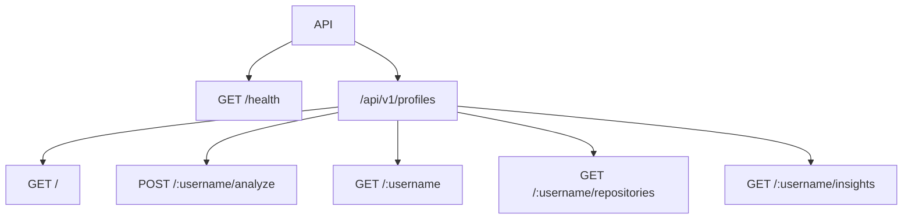
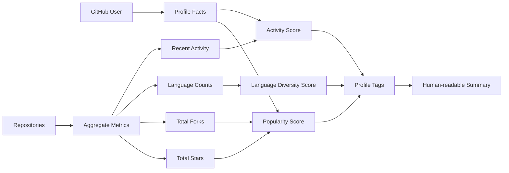
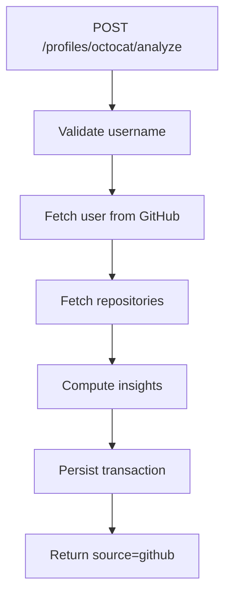
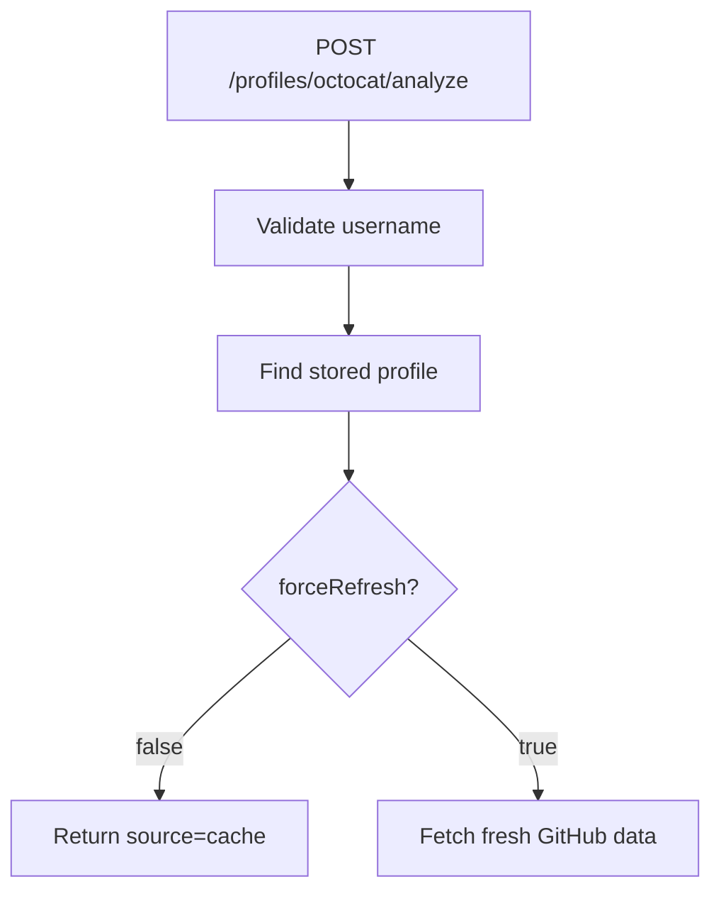

# API Documentation

This document describes the GitHub Profile Analyzer API contract, request parameters, response shapes, error codes, and operational flows.

## Base URL

```text
http://localhost:3000
```

Versioned API prefix:

```text
/api/v1
```

## Authentication

The current API does not require client authentication. GitHub API access uses public endpoints, with optional `GITHUB_TOKEN` configured server-side to improve rate limits.

## Response Envelope

All successful responses use:

```json
{
  "success": true,
  "data": {},
  "meta": {}
}
```

All failed responses use:

```json
{
  "success": false,
  "error": {
    "code": "ERROR_CODE",
    "message": "Human readable message",
    "details": {},
    "requestId": "uuid"
  }
}
```

`details` is optional. `requestId` is included for tracing and is also returned in the `x-request-id` response header.

## Endpoint Map



## Username Rules

`username` must satisfy GitHub username constraints:

- 1 to 39 characters
- Letters, numbers, and hyphens only
- Cannot start or end with a hyphen

Invalid usernames return `400 VALIDATION_ERROR`.

## Health Check

### `GET /health`

Returns basic API health.

#### Example

```bash
curl "http://localhost:3000/health"
```

#### Response

```json
{
  "success": true,
  "data": {
    "status": "ok",
    "uptimeSeconds": 120,
    "timestamp": "2026-05-30T07:00:00.000Z"
  }
}
```

## Analyze Profile

### `POST /api/v1/profiles/:username/analyze`

Fetches a public GitHub profile, analyzes repositories, stores results in MySQL/TiDB, and returns the persisted analysis.

If an analysis already exists and `forceRefresh=false`, cached data is returned.

### Query Parameters

| Name | Type | Default | Description |
| --- | --- | --- | --- |
| `forceRefresh` | `true` or `false` | `false` | Force a fresh GitHub fetch and overwrite stored analysis |
| `maxRepositories` | integer `1-100` | `100` | Maximum repositories to analyze |

### Example

```bash
curl -X POST "http://localhost:3000/api/v1/profiles/octocat/analyze?forceRefresh=true&maxRepositories=100"
```

### Success Status

- `201 Created` when fetched from GitHub and persisted
- `200 OK` when returned from cache

### Response

```json
{
  "success": true,
  "data": {
    "profile": {
      "id": 1,
      "githubId": 583231,
      "username": "octocat",
      "displayName": "The Octocat",
      "avatarUrl": "https://avatars.githubusercontent.com/u/583231?v=4",
      "profileUrl": "https://github.com/octocat",
      "bio": null,
      "publicRepos": 8,
      "followers": 16000,
      "following": 9,
      "analysisStatus": "completed"
    },
    "repositories": [],
    "insights": {
      "totalStars": 12000,
      "totalForks": 4000,
      "analyzedRepositories": 8,
      "originalRepositoryCount": 8,
      "forkRepositoryCount": 0,
      "languageCount": 4,
      "topLanguages": [
        {
          "language": "JavaScript",
          "repositories": 3,
          "stars": 6000
        }
      ],
      "topRepositories": [],
      "recentRepositories": [],
      "activityScore": 82,
      "popularityScore": 95,
      "languageDiversityScore": 48,
      "profileTags": ["polyglot", "active-maintainer"],
      "summary": "octocat has 8 public repositories..."
    },
    "source": "github"
  },
  "meta": {
    "source": "github"
  }
}
```

## List Stored Profiles

### `GET /api/v1/profiles`

Returns paginated stored profile analyses.

### Query Parameters

| Name | Type | Default | Description |
| --- | --- | --- | --- |
| `page` | positive integer | `1` | Page number |
| `limit` | integer `1-100` | `20` | Items per page |

### Example

```bash
curl "http://localhost:3000/api/v1/profiles?page=1&limit=20"
```

### Response

```json
{
  "success": true,
  "data": [
    {
      "id": 1,
      "githubId": 583231,
      "username": "octocat",
      "displayName": "The Octocat",
      "publicRepos": 8,
      "followers": 16000,
      "analysisStatus": "completed",
      "lastAnalyzedAt": "2026-05-30T07:00:00.000Z"
    }
  ],
  "meta": {
    "pagination": {
      "page": 1,
      "limit": 20,
      "total": 1,
      "totalPages": 1
    }
  }
}
```

## Get Stored Profile

### `GET /api/v1/profiles/:username`

Returns the stored profile, repositories, and insights for a previously analyzed GitHub username.

This endpoint does not fetch GitHub. Analyze the profile first if no stored result exists.

### Example

```bash
curl "http://localhost:3000/api/v1/profiles/octocat"
```

### Response

```json
{
  "success": true,
  "data": {
    "profile": {},
    "repositories": [],
    "insights": {}
  }
}
```

## Get Profile Repositories

### `GET /api/v1/profiles/:username/repositories`

Returns stored repositories for a previously analyzed profile.

### Example

```bash
curl "http://localhost:3000/api/v1/profiles/octocat/repositories"
```

### Response

```json
{
  "success": true,
  "data": [
    {
      "id": 1,
      "profileId": 1,
      "githubRepoId": 1296269,
      "name": "Hello-World",
      "fullName": "octocat/Hello-World",
      "repoUrl": "https://github.com/octocat/Hello-World",
      "primaryLanguage": null,
      "stars": 3000,
      "forks": 2500,
      "openIssues": 100,
      "watchers": 3000,
      "isFork": false,
      "topics": []
    }
  ]
}
```

## Get Profile Insights

### `GET /api/v1/profiles/:username/insights`

Returns only the stored computed insight object for a previously analyzed profile.

### Example

```bash
curl "http://localhost:3000/api/v1/profiles/octocat/insights"
```

### Response

```json
{
  "success": true,
  "data": {
    "totalStars": 12000,
    "totalForks": 4000,
    "analyzedRepositories": 8,
    "originalRepositoryCount": 8,
    "forkRepositoryCount": 0,
    "languageCount": 4,
    "topLanguages": [],
    "topRepositories": [],
    "recentRepositories": [],
    "activityScore": 82,
    "popularityScore": 95,
    "languageDiversityScore": 48,
    "profileTags": ["polyglot"],
    "summary": "octocat has 8 public repositories..."
  }
}
```

## Insight Calculation



### Scores

| Score | Range | Inputs |
| --- | --- | --- |
| `activityScore` | `0-100` | public repo count, recently updated repos, followers |
| `popularityScore` | `0-100` | total stars, forks, followers |
| `languageDiversityScore` | `0-100` | number of unique primary languages |

### Tags

Possible tags include:

| Tag | Meaning |
| --- | --- |
| `polyglot` | Uses at least four primary languages |
| `active-maintainer` | High activity score |
| `open-source-visible` | High popularity score |
| `fork-heavy` | More than half of analyzed repos are forks |
| `web-development` | Uses web-oriented languages |
| `backend-capable` | Uses backend/system languages |

## Error Codes

| Code | HTTP Status | Meaning |
| --- | --- | --- |
| `VALIDATION_ERROR` | `400` | Request params/query/body failed validation |
| `NOT_FOUND` | `404` | Route or resource does not exist |
| `GITHUB_USER_NOT_FOUND` | `404` | GitHub username does not exist |
| `GITHUB_RATE_LIMITED` | `429` | GitHub API rate limit exceeded |
| `GITHUB_API_ERROR` | `502` | GitHub API returned an unexpected error |
| `ANALYSIS_NOT_FOUND` | `404` | Profile has not been analyzed yet |
| `DATABASE_ERROR` | `500` | Database operation failed |
| `INTERNAL_ERROR` | `500` | Unhandled application error |

## Common Workflows

### First-time analysis



### Cached analysis



## Rate Limiting

The API uses `express-rate-limit`.

Default values:

```env
RATE_LIMIT_WINDOW_MS=900000
RATE_LIMIT_MAX=100
```

That means 100 requests per 15 minutes per client IP by default.

## Database Behavior

The app uses a repository layer as the only SQL boundary.

Profile analysis persistence is transactional:

1. Upsert profile.
2. Replace stored repositories for the profile.
3. Upsert computed insights.
4. Commit transaction.

If any step fails, the transaction rolls back.

## Postman Collection

Import:

```text
postman/GitHub_Profile_Analyzer.postman_collection.json
```

Set collection variables:

| Variable | Example |
| --- | --- |
| `baseUrl` | `http://localhost:3000` |
| `username` | `octocat` |

## Operational Notes

- Add `GITHUB_TOKEN` for reliable testing against GitHub.
- Use `forceRefresh=true` when you want to bypass cached analysis.
- Use `maxRepositories=100` for broad analysis and lower values for quick testing.
- Keep `DB_AUTO_MIGRATE=true` in development for convenience.
- Prefer a controlled migration process in production.
