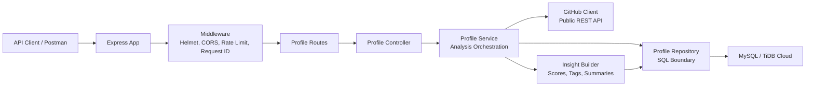
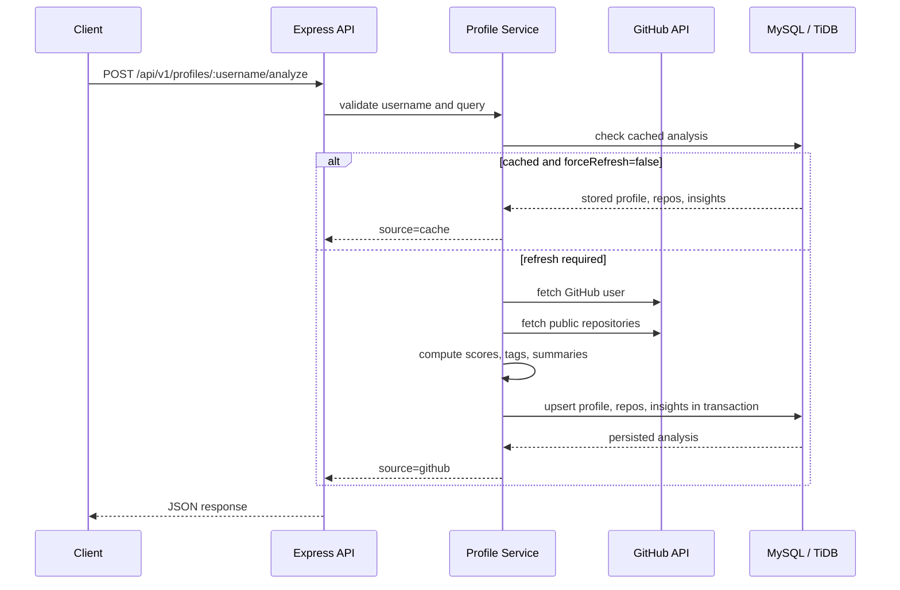
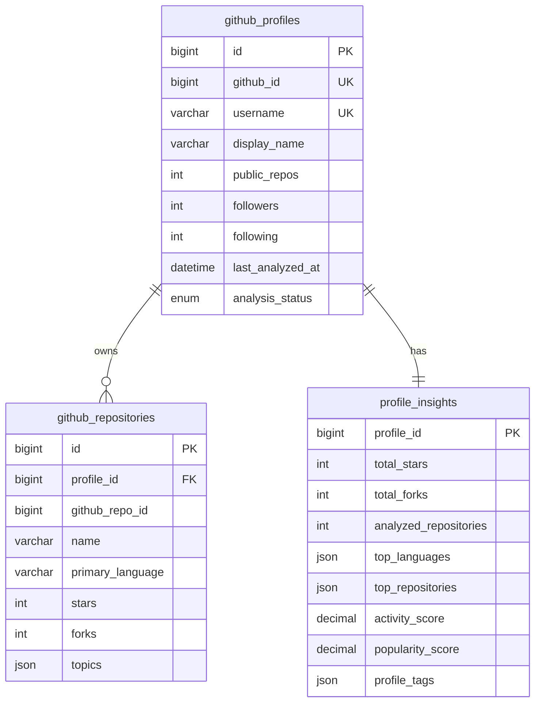

# GitHub Profile Analyzer API

> A production-minded TypeScript backend that turns any public GitHub username into stored, queryable developer intelligence.

GitHub Profile Analyzer API fetches public GitHub profile and repository data, computes useful engineering signals, and persists the complete analysis in a MySQL-compatible database. It is built with a scalable Express architecture, TiDB Cloud support, robust error handling, validation, and clean documentation for real submission workflows.

## Highlights

- Analyze public GitHub profiles by username.
- Persist profile metadata, repositories, and derived insights.
- Fetch all stored analyses or drill into one profile.
- Compute activity, popularity, language diversity, top repositories, recent repositories, and profile tags.
- Use TiDB Cloud or local MySQL with the same code path.
- Auto-create database/tables on startup with `DB_AUTO_MIGRATE=true`.
- Centralized request validation, rate limiting, request IDs, and stable JSON error responses.
- Includes database schema, Postman collection, decision log, and dedicated API documentation.

## Tech Stack

| Layer | Technology |
| --- | --- |
| Runtime | Node.js |
| API Framework | Express.js |
| Language | TypeScript |
| Database | MySQL / TiDB Cloud |
| GitHub Integration | GitHub REST API |
| Validation | Zod |
| Security Middleware | Helmet, CORS, express-rate-limit |

## System Architecture



## Analysis Flow



## Database Model



## API Overview

Base URL:

```text
http://localhost:3000
```

| Method | Endpoint | Purpose |
| --- | --- | --- |
| `GET` | `/health` | Service health check |
| `POST` | `/api/v1/profiles/:username/analyze` | Analyze and store a GitHub profile |
| `GET` | `/api/v1/profiles` | Fetch all stored analyzed profiles |
| `GET` | `/api/v1/profiles/:username` | Fetch one stored profile with repos and insights |
| `GET` | `/api/v1/profiles/:username/repositories` | Fetch stored repositories for one profile |
| `GET` | `/api/v1/profiles/:username/insights` | Fetch stored computed insights |

Full endpoint details live in [API_DOCUMENTATION.md](./API_DOCUMENTATION.md).

## Project Structure

```text
src/
  app.ts
  server.ts
  config/
    database.ts
    env.ts
  errors/
    AppError.ts
    errorCodes.ts
  integrations/
    github/
      github.client.ts
  middleware/
    error.middleware.ts
    rateLimit.middleware.ts
    requestId.middleware.ts
    validate.middleware.ts
  modules/
    health/
    profiles/
      profile.controller.ts
      profile.mappers.ts
      profile.repository.ts
      profile.routes.ts
      profile.schemas.ts
      profile.service.ts
  types/
  utils/
database/
  schema.sql
docs/
  DECISIONS_LOG.md
  TIDB_CLOUD_SETUP.md
postman/
  GitHub_Profile_Analyzer.postman_collection.json
```

## Quick Start

Install dependencies:

```bash
npm install
```

Create your environment file:

```bash
cp .env.example .env
```

Start the API:

```bash
npm run dev
```

The server starts at:

```text
http://localhost:3000
```

## TiDB Cloud Configuration

Use `DATABASE_URL` for TiDB Cloud. The application automatically enables TLS for TiDB Cloud hosts and creates missing database objects when `DB_AUTO_MIGRATE=true`.

```env
DATABASE_URL=mysql://2vfGSezohd4Q5rd.root:<PASSWORD>@gateway01.ap-southeast-1.prod.aws.tidbcloud.com:4000/github_analyzer
MYSQL_SSL=true
DB_AUTO_MIGRATE=true
```

Replace `<PASSWORD>` with your real TiDB Cloud password. Use an application database such as `github_analyzer`, not `/sys`.

Local MySQL is also supported by commenting out `DATABASE_URL` and using the `MYSQL_HOST`, `MYSQL_PORT`, `MYSQL_USER`, `MYSQL_PASSWORD`, and `MYSQL_DATABASE` variables.

## Environment Variables

| Variable | Required | Description |
| --- | --- | --- |
| `PORT` | No | API port, defaults to `3000` |
| `API_PREFIX` | No | API prefix, defaults to `/api/v1` |
| `DATABASE_URL` | Recommended | MySQL/TiDB connection URL |
| `MYSQL_SSL` | For TiDB | Enables TLS connection |
| `DB_AUTO_MIGRATE` | No | Creates missing DB/tables on startup |
| `MYSQL_CONNECTION_LIMIT` | No | Connection pool size |
| `GITHUB_TOKEN` | No | Optional token for better GitHub API limits |
| `GITHUB_API_BASE_URL` | No | GitHub API base URL |
| `RATE_LIMIT_WINDOW_MS` | No | API rate limit window |
| `RATE_LIMIT_MAX` | No | Max requests per rate limit window |

## Example Usage

Analyze a GitHub user:

```bash
curl -X POST "http://localhost:3000/api/v1/profiles/octocat/analyze?forceRefresh=true&maxRepositories=100"
```

List stored profiles:

```bash
curl "http://localhost:3000/api/v1/profiles?page=1&limit=20"
```

Fetch one profile:

```bash
curl "http://localhost:3000/api/v1/profiles/octocat"
```

Fetch insights only:

```bash
curl "http://localhost:3000/api/v1/profiles/octocat/insights"
```

## Response Contract

Success response:

```json
{
  "success": true,
  "data": {},
  "meta": {
    "source": "github"
  }
}
```

Error response:

```json
{
  "success": false,
  "error": {
    "code": "GITHUB_USER_NOT_FOUND",
    "message": "GitHub user not found",
    "requestId": "8eadb8cc-4a2c-43f1-bda9-b0e9ab482992"
  }
}
```

## NPM Scripts

| Script | Purpose |
| --- | --- |
| `npm run dev` | Start development server with `tsx watch` |
| `npm run build` | Compile TypeScript to `dist` |
| `npm start` | Run compiled production server |
| `npm run typecheck` | Type-check without emitting files |
| `npm run lint` | Run ESLint |

## Submission Assets

- Database schema/export: [database/schema.sql](./database/schema.sql)
- API documentation: [API_DOCUMENTATION.md](./API_DOCUMENTATION.md)
- Postman collection: [postman/GitHub_Profile_Analyzer.postman_collection.json](./postman/GitHub_Profile_Analyzer.postman_collection.json)
- TiDB setup guide: [docs/TIDB_CLOUD_SETUP.md](./docs/TIDB_CLOUD_SETUP.md)
- Decision log: [docs/DECISIONS_LOG.md](./docs/DECISIONS_LOG.md)

## Production Notes

- Add a `GITHUB_TOKEN` in production to reduce GitHub rate-limit failures.
- Keep real `.env` values out of git.
- Set `DB_AUTO_MIGRATE=false` if your production deployment uses a controlled migration pipeline.
- Put the API behind HTTPS and a managed reverse proxy/load balancer.
- Monitor GitHub rate-limit errors and database connection pool saturation.

## Status

This backend is ready for local development, TiDB Cloud-backed persistence, Postman verification, and deployment to any Node.js runtime that can reach the configured MySQL-compatible database.
